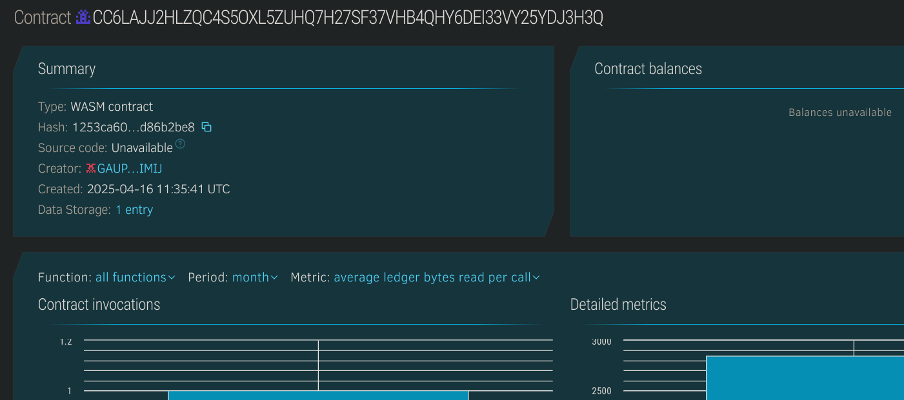

# NFT-Based Certificate Generator

## 📌 Project Title
**nft-based-certificate-generator**

---

## 📖 Project Description
This project leverages Soroban smart contracts to issue and manage academic or professional certificates as NFTs. Each certificate is uniquely associated with a user and can be verified on-chain through its metadata and issuance history.

---

## 🌟 Project Vision
To create a tamper-proof, decentralized, and verifiable certificate issuing system using blockchain technology. Institutions can issue NFT certificates that students or professionals can showcase as immutable credentials.

---

## 🚀 Key Features
- 🧾 Mint NFT certificates to user wallets with unique IDs.
- 🔗 Embed metadata links (IPFS/Arweave) for each certificate.
- 📂 Fetch and display all certificates issued to a user.
- 🧠 Certificates include course name, issue date, and ownership data.

---

## 🔮 Future Scope
- 🎓 Add revocation support for certificates.
- 🌐 Frontend to view/share certificates.
- 🔐 Role-based issuing (universities, instructors).
- 🧬 Support for certificate templates and designs.
- 📤 Metadata validation and standardization (e.g., OpenCerts schema).

## Contract Details
CC6LAJJ2HLZQC4S5OXL5ZUHQ7H27SF37VHB4QHY6DEI33VY25YDJ3H3Q

